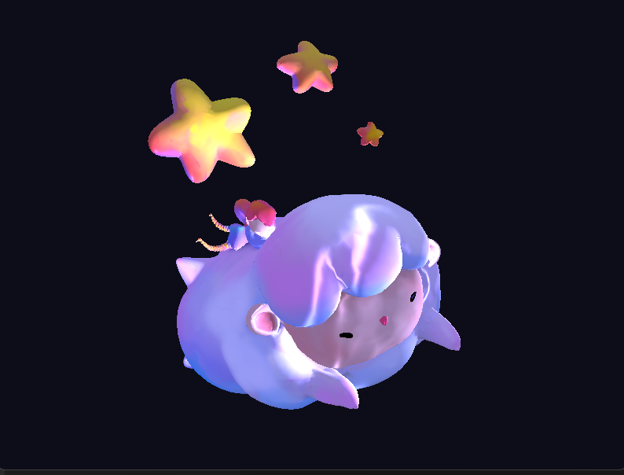

# DreamSheep-Simple-OpenGL-3D-Renderer

 

reference: https://www.behance.net/gallery/19119689/counting-sheep/modules/129304691

DreamSheep is a small **Modern OpenGL (C++) project** that renders a 3D scene using custom shaders, lighting, and camera controls.

This project was created as part of a university graphics assignment with the theme **“MY DREAM”**, focusing on understanding the fundamentals of 3D rendering rather than building a full engine.

## Overview
The application starts by sending vertex data and mesh information to the GPU, where all rendering is handled through the modern OpenGL pipeline. Custom vertex and fragment shaders are responsible for transforming the geometry from model space to screen space and applying basic lighting calculations.

A perspective camera is implemented to allow scene navigation, with keyboard input controlling movement and mouse input controlling the viewing direction. Textures are loaded at runtime using stb_image and applied to the 3D models during rendering.

Lighting is calculated in the fragment shader on a per-pixel basis, using the current light position and camera position to produce basic shading effects across the scene.

## What This Project Does
- Creates an 800 × 600 OpenGL window
- Renders a textured 3D model
- Applies basic lighting calculations in shaders
- Uses custom vertex and fragment shaders
- Supports camera movement and mouse look
- Draws a simple animated background using shaders

## Technologies Used
- C++
- Modern OpenGL (Core Profile)
- GLFW (Window & Input)
- GLEW (OpenGL Extension Loader)
- GLM (Math Library)
- stb_image (Texture Loading)

## Controls
- **W / A / S / D** – Move camera
- **Mouse** – Look around
- **Space / Left Shift** – Move up / down

## Install & Quickstart
**1. VS Code extensions**
- C/C++ (ms-vscode.cpptools)
- CMake Tools (ms-vscode.cmake-tools)

**2. Toolchain**
- Windows: Visual Studio 2022 (Desktop C++), Git, CMake
- macOS: Xcode CLT (```xcode-select --install```), Git, CMake, Ninja (```brew install cmake ninja```)
- Ubuntu/Debian: ```sudo apt install -y build-essential git cmake ninja-build```

**3. setup & clone**
```base
git clone https://github.com/sSODAs/DreamSheep-Simple-OpenGL-3D-Renderer.git
```

**4. vcpkg**
(one-time only after clone this project)
- Windows (PowerShell):
```base
git clone https://github.com/microsoft/vcpkg $env:USERPROFILE\vcpkg
& $env:USERPROFILE\vcpkg\bootstrap-vcpkg.bat
setx VCPKG_ROOT "$env:USERPROFILE\vcpkg"
```

- macOS/Linux:
```base
git clone https://github.com/microsoft/vcpkg ~/vcpkg ~/vcpkg/bootstrap-vcpkg.sh echo 'export
VCPKG_ROOT="$HOME/vcpkg"' >> ~/.zshrc # or ~/.bashrc export VCPKG_ROOT="$HOME/vcpkg"
```

